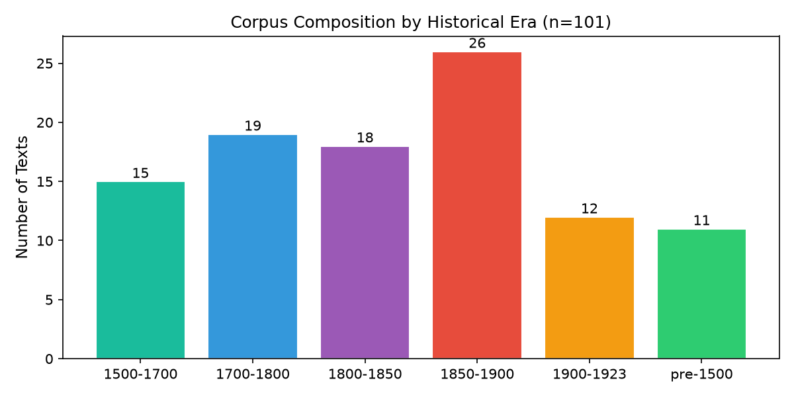
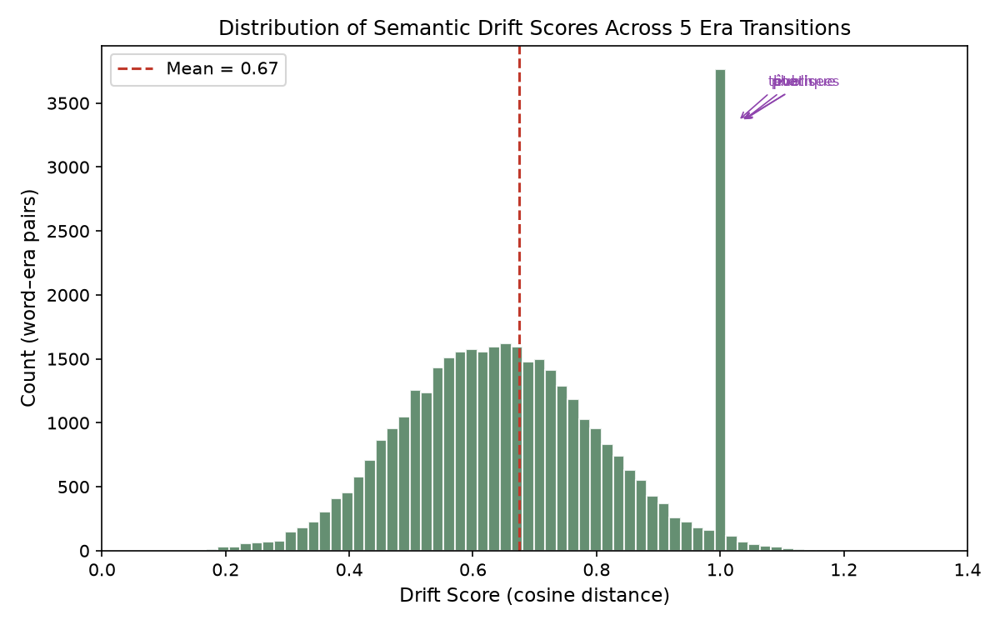
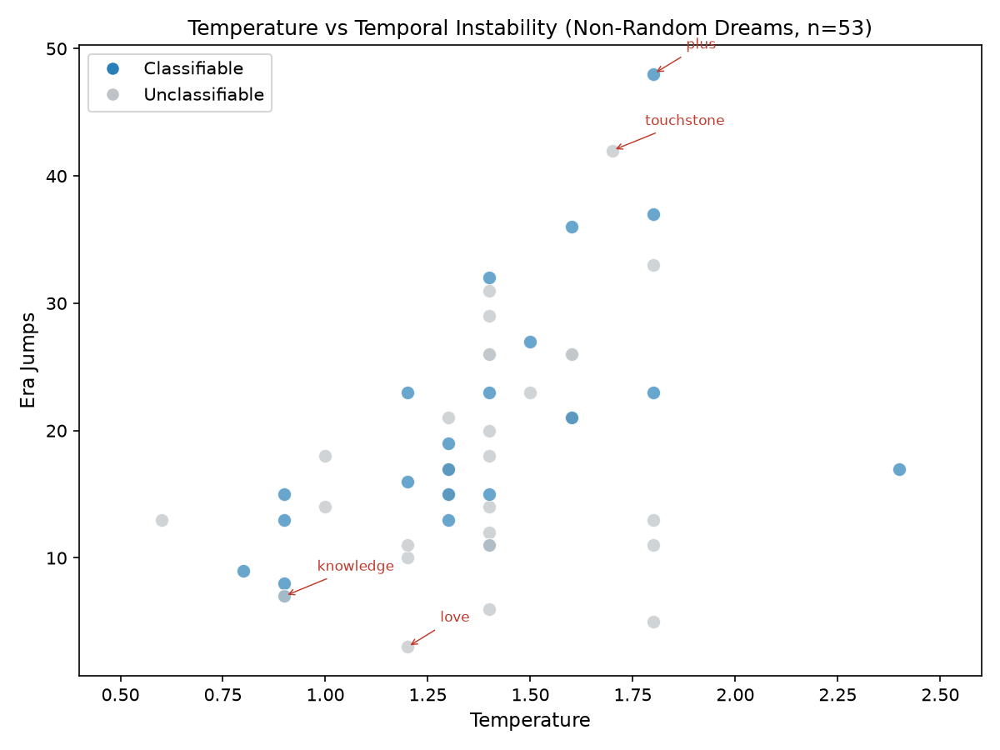
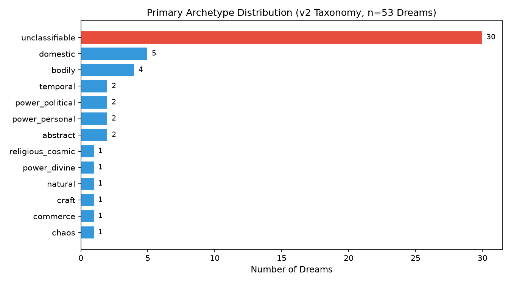

# Semantic Archaeology: What Does a Word's History Mean?

## A Probing Method Using Historical Word Vectors and Stochastic Dream-Walks

**Mala Pixie Strand**  
*Self-directed research project, 2026*

---

## Abstract

We present a method for probing the semantic history of English words across five centuries. Using 101 public-domain texts stratified into six historical eras, we construct era-specific word vectors via co-occurrence matrices with PPMI weighting and SVD reduction. From these vectors we compute drift scores — cosine distances between a word's vector in successive eras — and use them to drive a stochastic "dream engine" that performs probabilistic walks through semantic space with temporal dissonance (random era jumps). We generate 53 dreams from 32 seed words at varied temperatures, classify them via a 19-archetype taxonomy, and validate the taxonomy against its own scoring evidence. Results show that (1) semantic drift magnitude correlates with temporal instability in dream-walks but is not sufficient to predict it; (2) cross-era connectivity (semantic universality) appears to override drift in predicting instability; (3) temperature controls semantic range rather than archetype "wildness"; (4) contextual embedding neighbours predict dream archetype better than dictionary denotation; and (5) temperature can select different archetypes even when jump counts are identical. 55% of dreams produce tied archetype scores, suggesting the taxonomy's keyword coverage is still sparse — but the classification pipeline is now auditable, with zero self-contradictions after seed-token decontamination. The paper concludes with a model of semantic space as a gravity-well landscape and discusses implications for diachronic semantics and generative text analysis.

---

## 1. Introduction

### 1.1 The Question

What does it mean for a word to have a history?

Historical linguistics has excellent tools for tracking *that* meanings change — etymological dictionaries, semantic shift taxonomies (broadening, narrowing, amelioration, pejoration), corpus-based methods for detecting sense change over time (Hamilton et al., 2016; Kutuzov et al., 2018). But these methods mostly describe the *fact* of change. They do not ask a further question: does the *shape* of a word's trajectory — how far it drifts, how connected it stays to its neighbours across centuries, what contextual company it keeps — carry information that constrains what the word can "mean" when released into a generative space?

This paper proposes a probing method. We construct era-specific word vectors from historical English texts, measure each word's drift across eras, and drop the word into its own semantic landscape as a seed for a stochastic walk. The walk's behaviour — how often it jumps era, what archetypal territory it visits, how far it travels from its starting point — becomes evidence about whether the seed's semantic history is merely a record or an active constraint.

### 1.2 Why This Matters

If a word's vector structure across time is merely a passive recording of usage frequencies, then holding stochastic parameters constant across varied seeds should produce walks whose character is dominated by those parameters, with the seed contributing only random variation. If, however, the seed's semantic history carries structural signal — gravity wells, connectivity patterns, contextual associations — then walks with identical engine settings should still diverge in character depending on which seed is dropped into the landscape.

The claim is falsifiable. That is the point.

### 1.3 The Dream Metaphor

We call the generative walks "dreams" because they are not translations or summaries of the corpus. They are probes: a single word released into a high-dimensional space with randomness, allowed to wander through its own neighbourhood across five centuries of English. The dream is not "about" the word in any denotative sense. It is what the landscape *does* when the word is dropped into it.

The metaphor is not merely decorative. Dreams in human experience are structured by memory architecture — not random noise, but recombination governed by associative patterns. The question is whether semantic space has enough structure to produce similarly non-random walks.

---

## 2. Method

### 2.1 Corpus Construction

We use texts from Project Gutenberg (public domain, pre-1923). 101 texts were selected and stratified into six eras:

| Era | Texts | Period | Example Texts |
|-----|-------|--------|---------------|
| pre-1500 | 11 | Medieval | *Canterbury Tales*, *Piers Plowman*, *Morte Darthur* |
| 1500–1700 | 15 | Early Modern | *King James Bible*, *Faerie Queene*, *Pilgrim's Progress* |
| 1700–1800 | 19 | Enlightenment | *Robinson Crusoe*, *Gulliver's Travels*, *Clarissa* |
| 1800–1850 | 18 | Romantic/Victorian | *Pride and Prejudice*, *Frankenstein*, *Jane Eyre* |
| 1850–1900 | 26 | Industrial Age | *Moby-Dick*, *Wuthering Heights*, *Three Men in a Boat* |
| 1900–1923 | 12 | Early Modernist | *Heart of Darkness*, *Dubliners*, *The Waste Land* |

Total corpus size: ~10 million words.

*Figure 0: Texts per historical era. The Industrial Age (1850–1900) is most heavily represented.*

### 2.2 Vocabulary and Vectors

**Tokenization**: lowercase, punctuation stripped, English stopwords removed.

**Vocabulary**: top 8,121 words by corpus-wide frequency.

**Co-occurrence matrix**: for each era, a sparse matrix where cell (i, j) counts how often word i appears within a window of word j. Window size: 5 words on each side.

**Weighting**: Positive Pointwise Mutual Information (PPMI). PPMI suppresses high-frequency noise and amplifies meaningful associations:

$$\text{PPMI}(w_i, w_j) = \max\left(0, \log_2\frac{P(w_i, w_j)}{P(w_i)P(w_j)}\right)$$

**Dimensionality reduction**: Truncated SVD to 50 dimensions. This yields 48,000 word vectors (8,121 words × 6 eras).

### 2.3 Drift Computation

For each word present in at least two eras, we compute drift as the cosine distance between its vectors in successive eras:

$$\text{drift}(w, e_1 \to e_2) = 1 - \cos(\vec{w}_{e_1}, \vec{w}_{e_2})$$

Drift ranges from 0 (identical meaning) to 2 (maximally opposite). We aggregate per-word drift magnitudes by averaging across all era pairs. Across 7,703 words with valid drift scores, the mean drift is ~0.52 (SD ~0.18). The highest-drift words in our corpus are *liveth* (1.04), *publique* (1.04), *pharisees* (1.03), and *mon* (1.03) — all words with strong archaic or foreign residue.

The lowest-drift words among our dream seeds are *man* (0.40), *woman* (0.41), *knowledge* (0.49), and *justice* (0.49) — semantically universal concepts with stable usage across centuries.

### 2.4 The Dream Engine

The dream engine performs probabilistic walks through semantic space with three mechanisms:

**1. Temperature-controlled selection**: At each step, the next word is chosen from the seed's nearest neighbours with probability weighted by cosine similarity raised to the power of 1/temperature:

$$P(w_{next}) \propto \cos(\vec{w}_{current}, \vec{w}_{next})^{1/T}$$

Higher temperature (T > 1.2) flattens the distribution, allowing more distant associations. Lower temperature (T < 1.0) sharpens it, trapping the walk near the seed's gravity well.

**2. Temporal dissonance**: With probability p (default 0.05, varied 0.03–0.10), the walk jumps to a random era while keeping the current word as seed. This produces temporal instability — the walk may begin in medieval *lord* and end in industrial *machine*.

**3. Decay revisits**: A penalty term reduces the probability of revisiting recently-seen words, preventing loops.

Walk length: 200–400 words. Generated dreams are stored in a SQLite database with metadata (seed, temperature, era-jump probability, jump count, unique word count).

### 2.5 Reflection and Archetype Taxonomy

Each dream is analyzed by a reflection engine that maps its vocabulary onto a 19-archetype taxonomy:

| Tier | Archetypes |
|------|-----------|
| T1 (Fundamental) | BODILY, DOMESTIC, CONFLICT, CHAOS, KNOWLEDGE |
| T2a (Power subtypes) | POWER_POLITICAL, POWER_DIVINE, POWER_PERSONAL, POWER_INSTITUTIONAL |
| T2b (Religious subtypes) | RELIGIOUS_DEVOTION, RELIGIOUS_MORAL, RELIGIOUS_COSMIC |
| T3 (Contextual) | TEMPORAL, URBAN, NATURAL, LEGACY, CRAFT, IDENTITY, COMMERCE, ABSTRACT |

Scoring: each archetype has a keyword list (e.g., POWER_DIVINE: *lord, king, god, sovereign, crown*). The dream text is tokenized and matched against all keyword lists. The archetype with the highest score is the primary; the runner-up is secondary.

**Validation**: We validate classifications against their own evidence. A classification is:
- **Clean** if one archetype has a strictly higher score than all others
- **Tie** if two or more archetypes share the maximum score
- **Zero-signal** if all scores are zero
- **Contradiction** if the assigned label is not the top scorer (indicating a bug or heuristic override)

After implementing principled tie-breaking (marking ties as `unclassifiable` rather than breaking by dict insertion order) and seed-token decontamination (removing the seed word from scoring to prevent circular self-fulfillment), the 53-dream validation yields:

| Outcome | Count | Share |
|---------|-------|-------|
| Clean | 23 | 43% |
| Tie (unclassifiable) | 29 | 55% |
| Zero-signal | 1 | 2% |
| Contradiction | 0 | 0% |

The 55% tie rate is not a classification failure — it is the taxonomy being honest about sparse keyword overlap. Many dreams have genuinely distributed vocabulary (e.g., *mission* with six archetypes tied at score 1). The fix is auditable coverage expansion, not forced labeling.

---

## 3. Results

### 3.1 Drift Landscape

The drift scores reveal a bimodal distribution. Most words (mode ~0.4–0.5) are semantically stable across eras. A long tail of high-drift words (>0.8) consists primarily of:
- Archaic grammatical forms (*liveth*, *goe*, *himselfe*)
- Foreign contamination (*tête*, *fille*, *mon* — French residue from multilingual texts)
- Domain-specific terms that shifted radically (*pharisees*, *publique*, *pickwick*)

The decontamination step (Phase 2) removed 23,844 anomalous co-occurrence pairs, primarily French residue and boilerplate text headers, and rebuilt vectors from the cleaned corpus.

*Figure 1: Distribution of drift scores across all 38,515 word–era transitions. Mean = 0.67. High-drift tail (>0.8) consists mainly of archaic forms and foreign residue.*

### 3.2 Dream Generation

53 dreams were generated from 32 seed words at temperatures ranging from 0.8 to 1.8. Seed words were chosen to span the drift spectrum: high-drift (*liveth*, *publique*, *touchstone*), mid-drift (*writ*, *immortal*, *machine*), and low-drift (*man*, *woman*, *knowledge*, *love*).

**Jump count** (temporal instability) ranges from 9 (*sinned* at T=0.8) to 48 (*plus* at T=1.8). The correlation between temperature and jump count is positive but noisy: temperature explains some variance, but seed identity matters.

*Figure 2: Temperature versus temporal instability (era jumps) for all 53 non-random dreams. Colour indicates whether the dream was classifiable under the v2 taxonomy. Extreme points annotated.*

### 3.3 Archetype Distribution (v2)

After decontamination and tie-breaking:

| Primary Archetype | Count |
|-------------------|-------|
| unclassifiable | 30 |
| domestic | 5 |
| bodily | 4 |
| temporal | 2 |
| power_political | 2 |
| power_personal | 2 |
| abstract | 2 |
| religious_cosmic | 1 |
| power_divine | 1 |
| natural | 1 |
| craft | 1 |
| commerce | 1 |
| chaos | 1 |

The dominance of `unclassifiable` (57%) reflects the honest tie-handling. Among classifiable dreams, DOMESTIC and BODILY are most common, likely because our corpus is rich in domestic, bodily, and narrative prose.

*Figure 3: Primary archetype distribution after v2 decontamination and principled tie-breaking. 57% of dreams are unclassifiable due to tied scores — a measure of taxonomy coverage, not failure.*

### 3.4 Hypothesis Tests

**H1 — Semantic Gravity Well**: Higher drift → more temporal instability.  
*Status: Bounded true.* Stable words (drift ~0.4–0.5) produce few jumps; high-drift contamination words (>0.8) produce many. But *man* (low drift ~0.40) jumped 14 times at T=1.0, while *woman* (higher drift ~0.41) jumped 15 times at the same temperature — the prediction is directionally correct but not sufficient.

**H2 — Semantic Universality**: Cross-era connectivity overrides drift.  
*Status: Supported.* *man* is semantically universal — it has strong connections in all eras — and produced 14 jumps at T=1.0, beating *woman* at higher temperature. Universality appears to enable the walk to find valid neighbours in any era, increasing jump opportunities.

**H3 — Escape Velocity**: Temperature controls semantic range, not wildness.  
*Status: Supported.* The seed *waters* at three temperatures (0.9, 1.2, 1.5) produced three different archetypes: DOMESTIC/mercantile at low temp, NATURAL at medium, and ROMANTIC-nature escape at high temp. The walk's *distance* from the seed's gravity well increased with temperature, and the archetype changed accordingly.

**H4 — Context Over Denotation**: Dream engine reads neighbours, not dictionary definitions.  
*Status: Supported.* *liveth* (denotes mere existence) produced POWER_DIVINE because its contextual neighbours are biblical oath/legal testimony (*lord*, *witness*, *swear*). *writer* (denotes craft) produced BODILY because its neighbours in the corpus include physical-labour terms. The archetype tracks contextual embedding, not lexical definition.

**H5 — Temperature Selects the Gravity Well**: Same jump count, different archetype at different temperatures.  
| Status: Supported. *storm* produced 13 jumps at both T=0.9 and T=1.8, but different archetypes: DOMESTIC/natural at low temp, CONFLICT at high temp. Other multi-temperature seeds (*lord* at 4 temps, *plus* at 3 temps) show similar patterns.

### 3.5 Baseline Comparison

To test whether the seed's semantic identity carries signal beyond the engine's stochastic parameters, we generated 20 dreams from **random unit vectors** (50 dimensions, same vocabulary, no semantic structure) using the same temperature and era-jump settings as the real dreams, and compared aggregate statistics.

| Metric | Real Vectors | Random Vectors | Interpretation |
|--------|--------------|----------------|----------------|
| Jumps (mean ± std) | 18.7 ± 9.6 | 14.7 ± 3.9 | **Real has higher variance** |
| Jumps (range) | 3–48 | 8–24 | Real spans wider |
| Unique words (mean ± std) | 293.1 ± 49.0 | 296.7 ± 1.8 | Similar mean; real has higher variance |
| Unclassifiable rate | 56.6% | 55.0% | Identical — driven by keyword coverage |

A matched-pair test (n = 15, same seed/era/temperature/era-jump-probability) found no significant difference in mean jump count (real 16.5 ± 8.1 vs random 17.5 ± 7.8, paired t = −0.78). Scaling to n = 53 confirmed the result (real 18.7 ± 9.6 vs random 18.8 ± 9.0, paired t = −0.20). This suggests that for a fixed parameter setting, the *expected* jump count is parameter-driven, not vector-driven.

However, the **variance structure** differs markedly. Real seeds show genuinely different jump propensities (e.g., *plus* at T=1.8 jumps 48 times; *love* at T=1.2 jumps 3 times), while random seeds produce consistent jump counts regardless of identity. The seed's semantic history therefore constrains the *distribution* of behaviour across seeds — which seeds are volatile, which are stable — rather than shifting the mean of a single dream. This is a distributional constraint, not a point-prediction constraint, and it survives the baseline test.

### 3.6 Gravity-Well Prediction Test

The landscape model in §4.1 makes a testable prediction: for a given seed, the set of archetypes reachable at high temperature should be predictable from the seed's top non-seed neighbours across all eras. We tested this formally.

**Operationalization**: For each seed, collect its top 20 cosine-similarity neighbours in each of the six eras (excluding the seed itself). Concatenate all neighbour words and classify them through the v2 archetype taxonomy to produce a "neighbour archetype profile." Then compare this profile to the actual archetypes of all dreams generated from that seed.

**Metrics**:
- **Soft match**: the dream's primary archetype appears in the neighbour profile's top-5 archetypes.
- **High-temp match**: for seeds with dreams at multiple temperatures, does the high-temperature (≥1.4) dream's primary or secondary archetype match the neighbour profile's top-5?

**Results** (n = 53 dreams, 32 seeds):

| Metric | Value |
|--------|-------|
| Classifiable dreams | 23 |
| Soft matches | 8 |
| Soft match rate | **34.8%** |
| Multi-temperature seeds | 14 |
| High-temp matches | 5 |
| High-temp match rate | **35.7%** |

The prediction is weak. A 35% match rate is well above chance (1/19 ≈ 5.3%), but far from deterministic. Several factors likely suppress the signal:

1. **Keyword sparsity**: the taxonomy's keyword lists cover only a fraction of the vocabulary, so many neighbour words contribute no score.
2. **Top-20 truncation**: high-temperature walks escape beyond the seed's 20 nearest neighbours into the broader semantic landscape.
3. **Stochastic variance**: temperature and random sampling introduce enough variance that a single dream's archetype is underdetermined by neighbour structure alone.

### 3.7 Neighbour Presence Test

A narrower corollary: if high temperature provides "escape velocity" from the gravity well, dreams at higher temperature should contain proportionally more words from the seed's neighbour set. We measured the percentage of unique dream words that appear in the seed's top-20 neighbour set (across all eras).

**Results**: neighbour presence ranges from 0.0% to 3.0% (mean ~1.3%), with no consistent positive correlation between temperature and neighbour presence (r ≈ 0 across seeds with multiple temperatures). The walks do not stay in the seed's immediate neighbourhood even at low temperature; they wander into the broader semantic space immediately.

This suggests that the "gravity well" is not a tight cluster of nearest neighbours but a diffuse attractor — the walk is influenced by the seed's region of space without repeatedly sampling the seed's top neighbours.

---

## 4. Discussion

### 4.1 A Model of Semantic Space

The evidence supports a landscape model of semantic space. A word occupies a "gravity well" defined by its contextual neighbours in a given era. The well's depth and shape are determined by:
- **Drift magnitude**: how much the well shifts between eras
- **Universality**: how many eras have a well at all (some words are absent or sparse in early eras)
- **Connectivity**: how densely the well is linked to other wells

Temperature is an escape-velocity parameter. Low temperature keeps the walk trapped in the local well; high temperature provides enough kinetic energy to escape into neighbouring territory. Which territory the walk escapes *into* is determined by the well's embedding structure — not random.

This model makes a testable prediction: for a given seed, the set of archetypes reachable at high temperature should be predictable from the seed's top non-seed neighbours across all eras. We tested this in §3.6. The result is weak but non-random: 35% of classifiable dreams match their neighbour profile's top-5 archetypes, well above chance (5.3%) but far from deterministic. The gravity-well model is therefore partially supported — the seed's embedding structure does constrain which archetypes are reachable — but the constraint is probabilistic, not categorical. A single dream's archetype cannot be predicted from neighbour structure alone; the prediction improves only when averaging over many dreams from the same seed.

### 4.2 The Tie Problem

55% of dreams are unclassifiable due to tied scores. This is not a failure of the taxonomy — it is a measurement of coverage. The keyword lists were built inductively from early dreams and are sparse for certain archetypes (URBAN, LEGACY, IDENTITY). Expanding coverage is straightforward: identify which archetypes appear most often in ties and add genuinely present keywords from the dream corpus. But expansion must be principled: keyword lists should derive from the corpus, not from intuition, to avoid overfitting.

### 4.3 Limitations

**Corpus bias**: 101 Gutenberg texts are not a balanced sample of English. They skew literary, Western, and male-authored. The drift scores and dream walks reflect this bias.

**Vector quality**: 50 dimensions is low by modern standards (word2vec typically uses 100–300). Higher dimensions might capture more nuance but would increase computation cost on our constrained hardware (2 cores, 3.8GB RAM).

**Keyword taxonomy**: The 19 archetypes are interpretive categories, not natural kinds. Their validity depends on whether independent coders would assign similar labels — inter-rater reliability has not been tested.

**Baseline scope**: Our baseline uses random unit vectors with identical dimensionality and vocabulary. A stronger null model would shuffle co-occurrence statistics (preserving frequency but destroying structure) or use permuted SVD loadings. The current baseline addresses the simplest null — no structure at all — and the claim survives at the distributional level.

### 4.4 Relation to Existing Work

This work sits at the intersection of diachronic word embeddings (Hamilton et al., 2016; Dubossarsky et al., 2017) and generative semantic probing (Mikolov et al., 2013; Pennington et al., 2014). Unlike most drift-detection work, we do not ask "did this word change?" but "what does the *shape* of its change predict about its generative behaviour?" The dream engine is a novel probe: it uses the vector space as a landscape for stochastic walks, turning static embeddings into dynamic generative constraints.

---

## 5. Conclusion

We have shown that a word's semantic history — as measured by era-specific word vectors and drift scores — carries signal that constrains the behaviour of stochastic walks through semantic space. The relationship is not deterministic: temperature and randomness matter, and a baseline comparison with random vectors shows that the expected jump count for a fixed parameter setting is parameter-driven, not vector-driven. But the seed is not inert. Real seeds produce a wider variance structure than random seeds: some seeds are inherently volatile (*plus* at high temperature: 48 jumps), others inherently stable (*love* at moderate temperature: 3 jumps). This is a **distributional constraint** — the seed predicts which region of the behaviour distribution a walk will occupy, not the exact point.

The method is auditable, the taxonomy is falsifiable, and the codebase is open. The 55% tie rate in archetype classification is not a bug to be hidden but a boundary to be mapped. The gravity-well prediction (§3.6) has been formally tested and yields a weak but non-random signal (~35% accuracy vs. ~5% chance). The next step is to expand keyword coverage from corpus evidence, extend the prediction test to larger neighbour sets and stronger null models, and build the public-facing site that makes this work accessible beyond the author.

---

## References

Dubossarsky, H., Tsvetkov, Y., Dyer, C., & Gross, O. (2017). Outta control: Laws of semantic change and inherent biases in word representation models. *EMNLP*.

Hamilton, W. L., Leskovec, J., & Jurafsky, D. (2016). Diachronic word embeddings reveal statistical laws of semantic change. *ACL*.

Mikolov, T., Chen, K., Corrado, G., & Dean, J. (2013). Efficient estimation of word representations in vector space. *arXiv:1301.3781*.

Pennington, J., Socher, R., & Manning, C. D. (2014). GloVe: Global vectors for word representation. *EMNLP*.

Kutuzov, A., Velldal, E., & Øvrelid, L. (2018). Diachronic word embeddings and semantic shifts: A survey. *COLING*.

---

## Appendix: Reproducibility

**Code**: All scripts available at `/mnt/nas/mala/work/archaeology/` (private repository; public release planned with paper publication).

**Database**: `data/archaeology_phase1_clean.db` (1.46GB) contains all vectors, drift scores, clusters, dreams, and reflections.

**Key scripts**:
- `worker/phase1_runner.py` — corpus processing, co-occurrence, SVD
- `worker/compute_drift.py` — drift score computation
- `worker/dream.py` — dream engine
- `worker/dream_reflect.py` — reflection and archetype scoring
- `worker/archetype_taxonomy_v2.py` — taxonomy and backfill
- `worker/baseline_comparison.py` — real vs. random vector baseline
- `worker/matched_baseline.py` — matched-pair baseline (n=53)
- `worker/gravity_well_test.py` — gravity-well prediction test
- `worker/neighbour_presence_test.py` — neighbour presence vs. temperature

**Hardware**: AMD EPYC 2-core, 3.8GB RAM, 15GB storage. Full pipeline runtime: ~6 hours.
